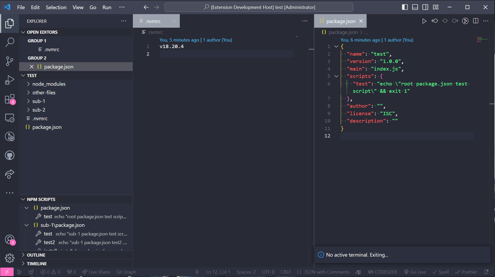

# Powerful NPM Run

## 功能

通过命令面板快速执行 npm 脚本并且自动切换 node 版本。

- 支持探测子目录中的npm脚本
- 根据同目录下的`.nvmrc`文件自动切换node版本

## 命令

- `npm run (Last Used Terminal)`: 显示所有可用的 npm 脚本，并在最后一次使用的终端中执行。
- `npm run (New Terminal)`: 显示所有可用的 npm 脚本，并在新的终端中执行。

## 路线图

- [ ] 配置默认node版本
- [ ] 支持`npm install`、`pnpm install`、`yarn install`等相关命令
- [ ] 记住每个工作区目录上次使用的命令
- [ ] 探测是否安装了nvm
- [ ] 支持通过任务执行npm脚本
- [ ] 国际化

## 协议

MIT
